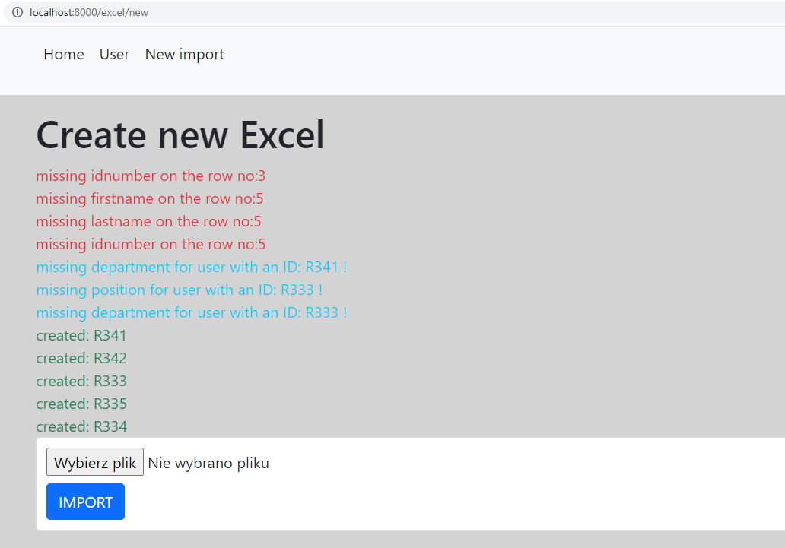
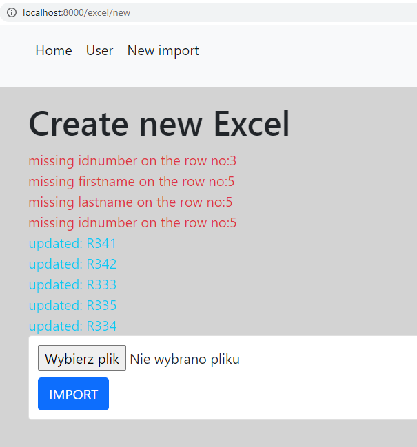

### EXCEL IMPORTER

## CURRENT VIEW:

# In case I load first file:

# In case I update file - it this sitation i have changed names in all of them:

## start

- be sure that symfony is installed: https://symfony.com/download
- clone directory
- composer install
- symfony server:start

## steps:

- make entities:
- User, Position and Department with relations OneToMany () User refers to One Position, Position refers to Many User etc)
- migrate to sql
- create a crud for each entity
- create entity excel + create crud
- create upload file system + use phpspreadsheet
- go to http://localhost:8000/
- use navigation to handle your actions
- you can access creating/updating/deleting deparments and positions putting urls by hand (it may be allowed to admin in the future)
- http://localhost:8000/position/ and
- http://localhost:8000/department/
