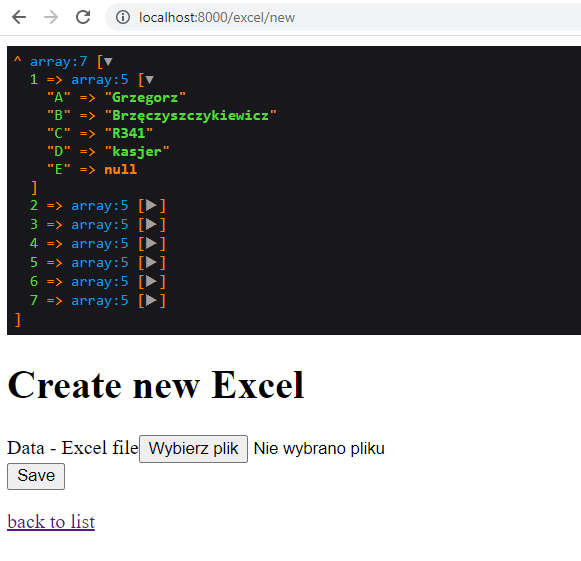

### EXCEL IMPORTER

## CURRENT VIEW:

## start

- be sure that symfony is installed: https://symfony.com/download
- clone directory
- composer install
- symfony server:start

## steps:

- make entities:
- User, Position and Department with relations OneToMany () User refers to One Position, Position refers to Many User etc)
- migrate to sql
- create a crud for each entity
- create entity excel + create crud
- create upload file system + use phpspreadsheet
